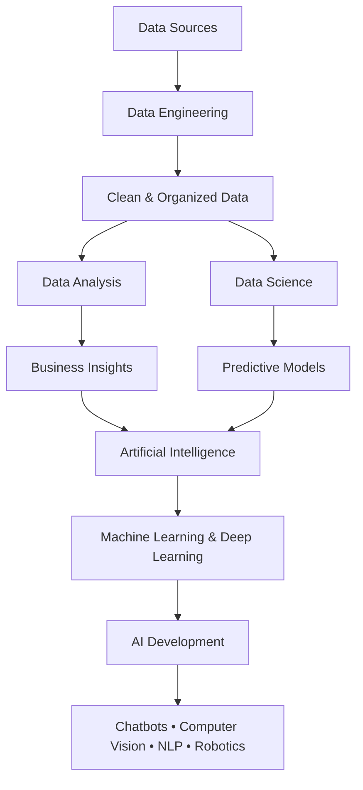

<h1>Here you will have the roadmap that divided into three levels, and each one has suggested courses.</h1>

> We often hear terms such as **Data Science, Data Analysis, Artificial Intelligence (AI), and Data Engineering**. While they are closely related, each field has a unique purpose, responsibilities, and career path. So, what are the differences between them?

# :arrow_right: What is Data Engineering
**Data Engineering** is the field of designing, building, and maintaining the infrastructure and systems that collect, process, store, and deliver data for analysis and machine learning. Data engineers develop reliable data pipelines to ensure that data is clean, organized, accessible, and ready for use by data analysts, data scientists, and AI engineers.

## 📊 What is Data Analysis?
**Data Analysis** is the process of collecting, cleaning, organizing, and analyzing data to uncover meaningful insights and support decision-making. Data analysts use statistical techniques and visualization tools to identify trends, patterns, and business opportunities from historical and current data.

# :chart_with_downwards_trend: What is Data Science?

**Data Science** is an interdisciplinary field that combines statistics, programming, and machine learning to extract knowledge from data and build predictive models. Data scientists analyze large datasets to discover patterns, generate insights, and develop data-driven solutions for complex problems.

# :arrow_right: What is Artificial Intelligence
**AI** refers to the simulation of human intelligence by programming machines to think like humans and imitate their behavior. The concept of AI can also be applied to machines that exhibit human-like capabilities, such as learning and problem-solving.

[Click here for more information](youtube.com/watch?v=SLszG6sSInY&feature=youtu.be) 

📌 For Data Camp courses, the GitHub student pack gives 3 free months. [How to get it](youtube.com/watch?v=owO75M1Xv30&feature=youtu.be) || [Register Here](https://education.github.com/pack) 

  

# 🟢  Beginner Level 
> You can use both Python and R as programming languages; however, I recommend Python as your primary choice. You will still encounter R, particularly in tasks related to data analytics and statistical analysis.
>Focus on understanding the fundamental concepts first. Do not rush into learning machine learning algorithms before building a strong foundation in Python and mathematics. Developing a clear understanding of >the concepts is essential at every stage of your learning journey.

| Topics | Resources |
|:....|:....:|....:|
| Python | [:movie_camera:Udacity](https://www.udacity.com/org/aws-ai-ml-scholars-program/course/introduction-to-python--ud1110)
[:movie_camera:Corey Schafer](https://youtube.com/playlist?list=PL-osiE80TeTt2d9bfVyTiXJA-UTHn6WwU&si=udnbLb2hbFvFVc_Y)
[:movie_camera:Arabic Course](https://youtube.com/playlist?list=PLDoPjvoNmBAyE_gei5d18qkfIe-Z8mocs&si=qFJVKbjyohBr78ge) 
[:page_facing_up:Python Basics.pdf](https://drive.google.com/file/d/1xhO5X5iGJeottX2dc2gNejQll0sTBgHz/view) |
| intro to CS with python | [:movie_camera:MIT Course](https://youtube.com/playlist?list=PLUl4u3cNGP63WbdFxL8giv4yhgdMGaZNA&si=0n0PwJOLKb4_I9E1) |
| Data Structures & Algorithms | [:movie_camera:MIT](https://ocw.mit.edu/courses/6-006-introduction-to-algorithms-spring-2020/) |
| Regular Rxpression | [:page_facing_up:DataCamp](https://www.datacamp.com/tutorial/python-regular-expression-tutorial) |
| Probability & Statistics | [:movie_camera:Descriptive Statistics](https://youtube.com/playlist?list=PLTNMv857s9WVStKLco6ZBOsfSGXzJ1L0f&si=HhD3MFQzLKCztMLU)
[:movie_camera:DataCamp, Into to statisitics](https://www.datacamp.com/courses/introduction-to-statistics?utm_medium=organic_social&utm_campaign=sharewidget&utm_content=coursedetailpage)
[:movie_camera:DataCamp, Into to Statistics with python]([&utm_content=coursedetailpage](https://www.datacamp.com/courses/introduction-to-statistics-in-python?utm_medium=organic_social&utm_campaign=sharewidget&utm_content=coursedetailpage)
[:movie_camera:Statistics Fundamentals](https://youtube.com/playlist?list=PLblh5JKOoLUK0FLuzwntyYI10UQFUhsY9&si=m1zy6reumGp1bNKN) |
| Pandas | [[:movie_camera:Datacamp, Data Manipulation with pandas](https://www.datacamp.com/courses/data-manipulation-with-pandas?utm_medium=organic_social&utm_campaign=sharewidget&utm_content=coursedetailpage)
[[:movie_camera:DataCamp, Joining Data with pandas](https://www.datacamp.com/courses/joining-data-with-pandas?utm_medium=organic_social&utm_campaign=sharewidget&utm_content=coursedetailpage)
[:page_facing_up:Pandas 100 tricks](https://www.kaggle.com/code/shivan118/pandas-100-tricks)
[:page_facing_up:Getting started with pandas](https://pandas.pydata.org/docs/getting_started/intro_tutorials/index.html) |

