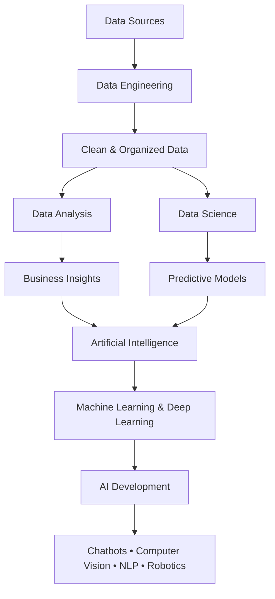

<h1>Here you will have the roadmap that divided into three levels, and each one has suggested courses.</h1>

> We often hear terms such as **Data Science, Data Analysis, Artificial Intelligence (AI), and Data Engineering**. While they are closely related, each field has a unique purpose, responsibilities, and career path. So, what are the differences between them?

# :arrow_right: What is Data Engineering
**Data Engineering** is the field of designing, building, and maintaining the infrastructure and systems that collect, process, store, and deliver data for analysis and machine learning. Data engineers develop reliable data pipelines to ensure that data is clean, organized, accessible, and ready for use by data analysts, data scientists, and AI engineers.

## 📊 What is Data Analysis?
**Data Analysis** is the process of collecting, cleaning, organizing, and analyzing data to uncover meaningful insights and support decision-making. Data analysts use statistical techniques and visualization tools to identify trends, patterns, and business opportunities from historical and current data.

# :chart_with_downwards_trend: What is Data Science?

**Data Science** is an interdisciplinary field that combines statistics, programming, and machine learning to extract knowledge from data and build predictive models. Data scientists analyze large datasets to discover patterns, generate insights, and develop data-driven solutions for complex problems.

# :arrow_right: What is Artificial Intelligence
**AI** refers to the simulation of human intelligence by programming machines to think like humans and imitate their behavior. The concept of AI can also be applied to machines that exhibit human-like capabilities, such as learning and problem-solving.

[Click here for more information](youtube.com/watch?v=SLszG6sSInY&feature=youtu.be) 

📌 For Data Camp courses, the GitHub student pack gives 3 free months. [How to get it](youtube.com/watch?v=owO75M1Xv30&feature=youtu.be) || [Register Here](https://education.github.com/pack) 

  

## 🟢 Beginner Level

> 💡 **Tip**:
> You can use both **Python** and **R** as programming languages; however, I recommend **Python** as your primary choice. You will still encounter R, particularly in tasks related to data analytics and statistical analysis.
>
> Focus on understanding the **fundamental concepts** first. Do not rush into learning machine learning algorithms before building a strong foundation in **Python and mathematics**. Developing a clear understanding of the concepts is essential at every stage of your learning journey.

| 📚 **Topic** | 🎯 **Resources** |
|:---|:---|
| 🐍 **Python** | 🎥 [Udacity – Introduction to Python](https://www.udacity.com/org/aws-ai-ml-scholars-program/course/introduction-to-python--ud1110) 🎥 [Corey Schafer – Python Playlist](https://youtube.com/playlist?list=PL-osiE80TeTt2d9bfVyTiXJA-UTHn6WwU&si=udnbLb2hbFvFVc_Y) 🎥 [Arabic Python Course](https://youtube.com/playlist?list=PLDoPjvoNmBAyE_gei5d18qkfIe-Z8mocs&si=qFJVKbjyohBr78ge) 📄 [Python Basics PDF](https://drive.google.com/file/d/1xhO5X5iGJeottX2dc2gNejQll0sTBgHz/view) |
| 💻 **Introduction to Computer Science with Python** | 🎥 [MIT – Introduction to Computer Science](https://youtube.com/playlist?list=PLUl4u3cNGP63WbdFxL8giv4yhgdMGaZNA&si=0n0PwJOLKb4_I9E1) |
| 🧩 **Data Structures & Algorithms** | 🎥 [MIT – Introduction to Algorithms](https://ocw.mit.edu/courses/6-006-introduction-to-algorithms-spring-2020/) |
| 🔤 **Regular Expressions** | 📄 [DataCamp – Python Regular Expressions Tutorial](https://www.datacamp.com/tutorial/python-regular-expression-tutorial) |
| 📊 **Probability & Statistics** | 🎥 [Descriptive Statistics](https://youtube.com/playlist?list=PLTNMv857s9WVStKLco6ZBOsfSGXzJ1L0f&si=HhD3MFQzLKCztMLU) 🎥 [DataCamp – Introduction to Statistics](https://www.datacamp.com/courses/introduction-to-statistics?utm_medium=organic_social&utm_campaign=sharewidget&utm_content=coursedetailpage) 🎥 [DataCamp – Introduction to Statistics in Python](https://www.datacamp.com/courses/introduction-to-statistics-in-python?utm_medium=organic_social&utm_campaign=sharewidget&utm_content=coursedetailpage) 🎥 [Statistics Fundamentals](https://youtube.com/playlist?list=PLblh5JKOoLUK0FLuzwntyYI10UQFUhsY9&si=m1zy6reumGp1bNKN) |
| 🐼 **Pandas** | 🎥 [DataCamp – Data Manipulation with Pandas](https://www.datacamp.com/courses/data-manipulation-with-pandas?utm_medium=organic_social&utm_campaign=sharewidget&utm_content=coursedetailpage) 🎥 [DataCamp – Joining Data with Pandas](https://www.datacamp.com/courses/joining-data-with-pandas?utm_medium=organic_social&utm_campaign=sharewidget&utm_content=coursedetailpage)  📄 [Pandas 100 Tricks](https://www.kaggle.com/code/shivan118/pandas-100-tricks)  📄 [Pandas – Getting Started](https://pandas.pydata.org/docs/getting_started/intro_tutorials/index.html) |
| **Numpy** | 🎥 [DataCamp - Introduction to NumPy](https://www.datacamp.com/courses/introduction-to-numpy?utm_medium=organic_social&utm_campaign=sharewidget&utm_content=coursedetailpage)  📄 [Tutorial](https://numpy.org/learn/)   📄 [Kaggel - Numpy tutorial](https://www.kaggle.com/code/legendadnan/numpy-tutorial-for-beginners-data-science)
| **Data Cleaning** | 🎥 [[DataCamp - Cleaning Data in Python](https://app.datacamp.com/learn/courses/cleaning-data-in-python)  📄 [Article](https://towardsdatascience.com/how-to-clean-your-data-in-python-8f178638b98d/)   📄 [Kaggle - Data Cleaning](https://www.kaggle.com/learn/data-cleaning)   [DataCamp - A Beginner’s Guide to Data Cleaning in Python](https://www.datacamp.com/tutorial/guide-to-data-cleaning-in-python) | 
---
## 🟡 intermediate Level
| 📚 **Topic** | 🎯 **Resources** |
|:---|:---|
| **1.Git** | 🎥 [Udacity - Version Control with Git](https://www.udacity.com/enrollment/ud123)  🎥 [Arabic Course](https://www.youtube.com/watch?v=Q6G-J54vgKc)  🎥 [Arabic Course](https://youtube.com/playlist?list=PLDoPjvoNmBAw4eOj58MZPakHjaO3frVMF&si=otqwY16AOo0SC9V_)|
| **Data Visualization** (Exploratory Data Analysis [EDA])| 🎥 (Understanding and Visualizing Data with Python)[https://www.coursera.org/learn/understanding-visualization-data]  🎥 [DataCamp - Introduction to Data Visualization with Matplotlib](https://app.datacamp.com/learn/courses/introduction-to-data-visualization-with-matplotlib)  🎥 [Corey Schafer - Matplotlib Tutorials](https://youtube.com/playlist?list=PL-osiE80TeTvipOqomVEeZ1HRrcEvtZB_&si=IIOsp2ISh9bZGafE)  🎥 [Kimberly Fessel - Matplotlib Tips](https://youtube.com/playlist?list=PLtPIclEQf-3dJmAj3IsSRwRoLbX-n3J81&si=EUNK0qGrCutnTG5J) 🎥 [DataCamp - Introduction to Data Visualization with Seaborn](https://app.datacamp.com/learn/courses/introduction-to-data-visualization-with-seaborn)  🎥 [[DataCamp - Intermediate Data Visualization with Seaborn](https://app.datacamp.com/learn/courses/intermediate-data-visualization-with-seaborn)  🎥 [Kimberly Fessel - Intro to Seaborn](https://youtube.com/playlist?list=PLtPIclEQf-3cG31dxSMZ8KTcDG7zYng1j&si=uRIJsXuXe_9cjOuC)  🎥 [DataCamp - Exploratory Data Analysis in Python](https://app.datacamp.com/learn/courses/exploratory-data-analysis-in-python) |
| **Dashboard (Power BI & Tableau)** | 📄 [Microsoft Learn - Get started building with Power BI](https://learn.microsoft.com/en-us/training/modules/get-started-with-power-bi/)  📄[Microsoft Learn - Clean, transform, and load data in Power BI](https://learn.microsoft.com/en-us/training/modules/clean-data-power-bi/)  📄 [Microsoft Learn - Get started with Microsoft data analytics](https://learn.microsoft.com/en-us/training/paths/data-analytics-microsoft/)  📄 [Microsoft Learn - Create visual calculations in Power BI Desktop](https://learn.microsoft.com/en-us/training/modules/power-bi-visual-calculations/)  🎥 [Tableau - Boost Your Tableau Skills](https://www.tableau.com/learn/training)  🎥 [DataCamp - Introduction to Tableau](https://app.datacamp.com/learn/courses/introduction-to-tableau)  🎥 [Coursera - Data Visualization with Tableau Specialization](https://www.coursera.org/specializations/data-visualization) | 
| **SQL & DataBase** | 🎥 [DataCamp - Introduction to SQL](https://app.datacamp.com/learn/courses/introduction-to-sql)  🎥 [DatCamp - Introduction to Relational Databases in SQL](https://app.datacamp.com/learn/courses/introduction-to-relational-databases-in-sql)  🎥 [FreeCodeCamp - SQL Tutorial](https://www.youtube.com/watch?v=HXV3zeQKqGY)  🎥 [Intermediate SQL](https://app.datacamp.com/learn/courses/intermediate-sql)  📝 [HackerRank - Practice](https://www.hackerrank.com/domains/sql) |
| **Web Scraping & APIs** | 🎥 [DataCamp - Web Scraping in Python](https://app.datacamp.com/learn/courses/web-scraping-with-python)  🎥 [DataCamp - Intermediate Importing Data in Python](https://app.datacamp.com/learn/courses/intermediate-importing-data-in-python)  [Article - How to Use an API in Python](https://www.dataquest.io/blog/api-in-python/) |
| **Time Series** | 🎥 [DataCamp - Time Series in Python](https://app.datacamp.com/learn/skill-tracks/time-series-with-python)  📄 [Kaggle - Learn Time Series](https://www.kaggle.com/learn/time-series)  📄 [GeeksforGeeks - Time Series Analysis and Forecasting](https://www.geeksforgeeks.org/machine-learning/time-series-analysis-and-forecasting/) |
| **Math for Machine Larning** | 🎥 [Coursera -Mathematics for Machine Learning and Data Science Specialization](https://www.coursera.org/specializations/mathematics-for-machine-learning-and-data-science)  🎥 [Khan Academy - probability](https://www.khanacademy.org/math/statistics-probability/probability-library)  🎥 [MIT OPenCourseWare - MIT RES.6-012 Introduction to Probability](https://youtube.com/playlist?list=PLUl4u3cNGP60hI9ATjSFgLZpbNJ7myAg6&si=63J_YqgHX_bk7Cme) |
| **Machine Learning** | 🎥 [Coursera - Machine Learning Specialization](https://www.coursera.org/specializations/machine-learning-introduction)  🎥 [Coursera - Machine Learning with Python](https://www.coursera.org/learn/machine-learning-with-python?specialization=ai-engineer&fbclid=IwAR35JlCKXk3OdCYVRFnK_pRXmiko5CHO7lKk5rLld8M3A9McbtIVPDn6AFs)  📕 [Hands on ML - Notebooks](https://github.com/ageron/handson-ml?fbclid=IwAR3s31KlwkLKyrEwuEd4UMOcvHN1Q9Z2LLGzPg5vP4UKSwjriHxU0uO405c)  📕 [Book(3rd Edition) - hands on ML](https://drive.google.com/file/d/11VeqPJw8s9SC9Ru7IVeQhiTyV_9TliOE/view)  🎥 [Arabic Course - Machine Learning](https://www.youtube.com/playlist?list=PLfNxJkQVCeH8ji-dk3xiA7RmsJvisUy_x)  🎥 [Arabic Course - Machine Learning Bootcamp](https://www.youtube.com/@ahmad-mostfa/playlists)  📕 [Notebooks - Arabic_ML_Bootcamp](https://github.com/a7madmostafa/Arabic_ML_Bootcamp) |
| **Feature Engineering** | 📕 [Book - Feature Engineering for Machine Learning](https://drive.google.com/file/d/1BkJYO0tqMYptTWUDQ7X0vd2aygohHRm8/view)  📄 [Kaggle - Feature Engineering](https://www.kaggle.com/learn/feature-engineering)
| **Model Deployment(1)** | 🌐 [Streamlit](https://streamlit.io/)  🌐 [Gradio](https://gradio.app/)  🎥 [Coursera - Build a Machine Learning Web App with Streamlit and Python](https://www.coursera.org/projects/machine-learning-streamlit-python)  🎥 [Coursera - Building AI Apps with Hugging Face Spaces and Gradio](https://www.coursera.org/learn/building-ai-apps-with-hugging-face-spaces-and-gradio)  🎥 [FreeCodeCamp - Build 12 Data Science Apps with Python and Streamlit](https://youtu.be/JwSS70SZdyM?si=eADq3SBNckBKJpT0) |
---
